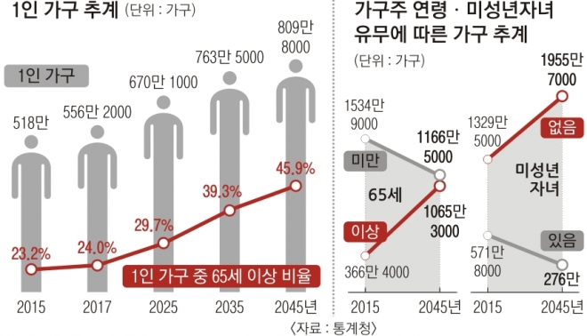
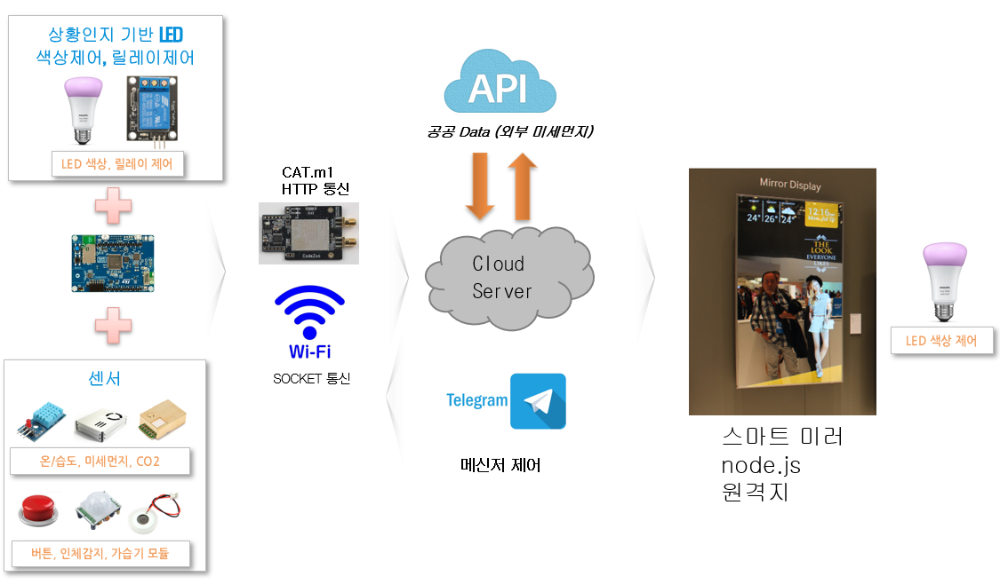

# Inha TB 프로젝트

  - 팀원
    김준호, 김응빈, 이수창, 김한결
    
  - 프로젝트명 : 우리집 && 우리엄빠
      - 사회적 약자와 사회적 문제 해결을 위한 실내환경 원격 모니터링 알리미
      - 타겟층 : 1인가구 노인을 따로 부양하는 
      
  - 개요
     - 시각 : 발전되는 기술로 사회적 약자를 원격으로 모니터링 하자
     - 코로나19와 같은 전파성 바이러스에 대한 관심도가 증가함에 따라 외부, 실내 환경에 대한 민감도가 높아짐 
     - 집에서의 활동시간 그로 인해 높아진 실내환경에 대한 관심도 증가
     - 상대적으로 실내환경에 취약한 사회적 약자 중 혼자사는 노인에 대한 거주환경 원격 모니터링 필요
     
     - 실내환경 요소
       - 온도/습도
         -> 냉난방기, 가습기 
         
       - 이산화탄소, 미세먼지
         -> 환기, 공기청정기

      - 실내외, 미세먼지에 따른 자연 환기 적정 시점
        -> 실내 < 실외 미세먼지 농도 높음
          
  - 관련근거 
  
     - 년도별 1인가구 추계 (자료 : 통계청) 
     
        </img>

     - 자연환기의 중요성 (출처 : wadiz.kr)
     
        </img>
        
  - 프로젝트 컨셉
  
      </img>
      
  - 프로젝트 구성도
  
    </img>
        
  - 프로젝트 차별성
  
     - 원격지에서 특정 장소의 실내환경을 지속 모니터링
     
        예) 자식 집에서 혼자 사는 부모님집 실내환경을 모니터링
        
  - 비즈니스 모델
  
      - 원격지 실내환경 모니터링 데이터를 통한 제품 광고 (예 : 공기청정기등)
       
  - 단계별 시스템 구성도 및 팀원 역할
  
    - 사용보드
   
        - STM32 보드 B-L4S5I-IOT01A
        - 라즈베리파이
        
    - 컴파일러
        - STM32CubeIDE
  
    - 김응빈
        - LCD, 릴레이, 필립스 HUE API 제어
        
    - 김준호
        - 미세먼지센서 제어, 공공 RestAPI, Cat.M1
    
    - 이수창 
        - 적외선온도센서, 생체 맥박 신호 센서 
        
    - 김한결
        - 스마트미러, Node.js, 하드웨어지원
    
  
    - Cube-ai 
    
        - 실내환경 품질 측정(노력중)
     
